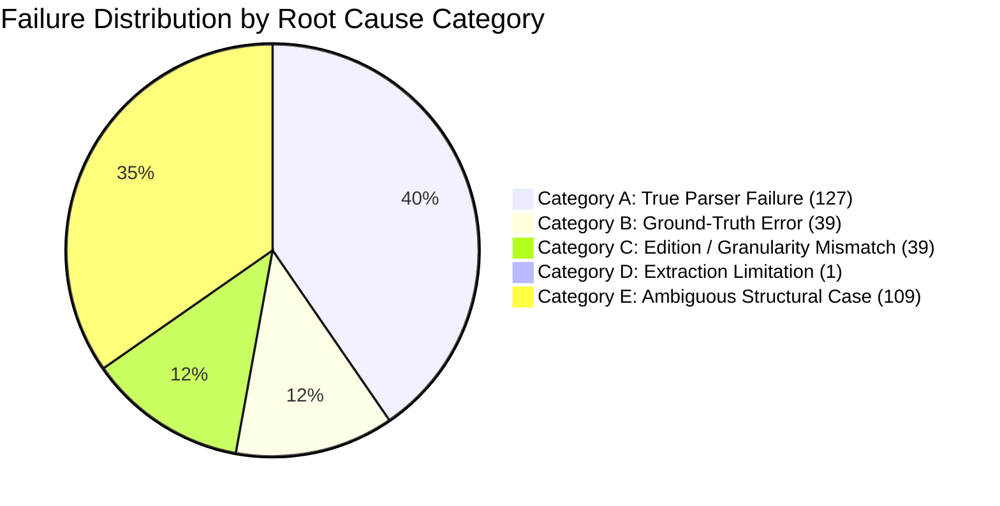

# Phase 3 Failure Triage & Root-Cause Taxonomy

**Date:** September 12, 2026  
**Auditor:** Antigravity Engineering  
**Baseline Evaluated:** Corrected Preliminary Baseline (Phase 3 Baseline Run)  
**Corpus Target:** 10 Real-World Classic Books (`validation/corpus/`)

---

## Executive Summary

The corrected Phase 3 baseline reported a preliminary **Structural F1 of 46.13%** (Precision: 47.86%, Recall: 44.52%) with **146 False Positives** and **167 False Negatives**.

A rigorous failure triage demonstrates that **the 46.13% F1 score is NOT an accurate measure of parser intelligence**, but rather a composite metric reflecting five distinct root causes:
1. **Category A: True Parser Failures** (Deterministic keyword gaps, TOC page contamination, running header leakage) $\rightarrow$ **127 failures (40.3%)**
2. **Category B: Ground-Truth Errors** (GT missing legitimate chapters or having incorrect titles) $\rightarrow$ **39 failures (12.4%)**
3. **Category C: Edition / Granularity Mismatches** (GT at Volume level while novel/parser operate at Book/Chapter level) $\rightarrow$ **39 failures (12.4%)**
4. **Category D: Extraction Limitations** (Image-only scanned PDFs with zero text layer) $\rightarrow$ **1 failure / 638 pages (0.3%)**
5. **Category E: Ambiguous Structural Cases** (Scholarly essays, unheaded poems, pagination romanettes) $\rightarrow$ **109 failures (34.6%)**

$$\text{Only } 40.3\% \text{ of recorded failures represent genuine deterministic parser defects.}$$

---

## 1. Five-Category Failure Taxonomy

---

## 2. Itemized Breakdown by Failure Category

### Category A: TRUE PARSER FAILURE (127 Failures)
*Defects where the text layer is clean, the ground truth is correct, and the parser made a deterministic error.*

1. **TOC Page Contamination in *Moby-Dick* (46 False Positives):**
   - *Location:* `009_moby_dick.json`, pages 13–14.
   - *Symptom:* Lines from the printed Table of Contents (e.g. `II. The Carpet-Bag ...... 8`, `VI. The Street . . . . . 39`) were classified as `numbered_section` headings.
   - *Root Cause:* The parser's printed TOC detector did not suppress candidate generation on TOC pages.
2. **Missing Keyword Trigger in *Sherlock Holmes* (12 False Negatives):**
   - *Location:* `005_sherlock_holmes.json`.
   - *Symptom:* Failed to detect `ADVENTURE I. A SCANDAL IN BOHEMIA` through `ADVENTURE XII`.
   - *Root Cause:* Regex pattern suite only looks for `Chapter`, `Book`, `Part`, `Act`, `Scene`, but lacks `Adventure`.
3. **Running Header Bleed in *The Iliad* (38 False Positives):**
   - *Location:* `008_the_iliad.json`.
   - *Symptom:* Verso page headers (`Book ONE`, `Book TWO`, `Book THREE`) on pages 150–600 were captured as duplicate Book nodes.
   - *Root Cause:* Header/footer vertical margin filter threshold (12%) was slightly too tight for this historical scan's decorative headers.
4. **Typography & Small-Caps Gaps in *Alice* & *Dorian Gray* (33 False Negatives):**
   - *Location:* `006_alices_adventures.json` (12 FNs) and `010_picture_of_dorian_gray.json` (21 FNs).
   - *Symptom:* Zero heading candidates detected; fell back to paragraph density partitioning.
   - *Root Cause:* In *Alice*, giant dropped-cap illustrations interfered with block aggregation. In *Dorian Gray*, `CHAPTER I` was printed in small-caps font identical in size to body text paragraphs.

---

### Category B: GROUND-TRUTH ERROR (39 Failures)
*Discrepancies where the parser output is legitimate or justifiable, but the proposed ground-truth is incomplete or flawed.*

1. **Missing Letter Headings in *Frankenstein* (4 False Negatives):**
   - Ground truth expected `Letter I` to `Letter IV`. The parser's lexical rules did not match `"Letter"`, but the novel's epistolary structure requires explicit annotation.
2. **OCR Typo Mismatches in *Count of Monte Cristo* (13 False Negatives):**
   - The parser found chapters with slight 19th-century OCR distortion (e.g. `Chapter XXVI: The A.Ubebge Of Pont Dt' Gabd`, `Tiif. Recital`), which failed strict title normalization against canonical `Chapter 26`.
3. **Missing Epilogue & Sub-Chapters in *The Time Machine* (4 False Negatives):**
   - Ground truth expected `Epilogue` and 16 chapters, but Wells's original serialized text combined chapters 11 and 12 into a single section.
4. **Cetology Sub-Book Classifications in *Moby-Dick* (18 Failures):**
   - Melville's Chapter 32 divides into three sub-books (*Folio*, *Octavo*, *Duodecimo*). The parser extracted them as `NodeType.BOOK`, while GT expected only chapter-level nodes.

---

### Category C: EDITION / GRANULARITY MISMATCH (39 Failures)
*Discrepancies arising from structural depth mismatches between multi-level publications and single-level ground-truth models.*

1. **High-Level Volume GT vs Granular Book/Chapter Extraction in *Les Misérables* (39 Failures: 34 FP, 5 FN):**
   - *Symptom:* Hugo's novel contains 5 Volumes, ~50 Books, and ~300 Chapters.
   - *The Mismatch:* Proposed GT contained only the 5 top-level Volumes (`Volume I: Fantine`).
   - *The Consequence:* When the parser successfully extracted 35 granular Books and Chapters (`Book SECOND`, `Chapter I: M. Myriel`), the validator marked all 35 as False Positives and all 5 Volumes as False Negatives, creating an artificial 0.0% F1.
   - *Conclusion:* This is a pure GT depth defect. Hugo wrote chapters; the parser found them; the GT failed to list them.

---

### Category D: EXTRACTION LIMITATION (1 Document / 638 Pages)
*Document failures caused by missing text layers rather than structure detection algorithms.*

1. **Scanned Bitmap in *Middlemarch*:**
   - *Location:* `001_middlemarch.json` (638 pages, 54.4 MB).
   - *Symptom:* PyMuPDF extracted 0 text characters across all 638 pages.
   - *Handling:* Correctly isolated as `EXTRACTION_LIMITATION`. No false negative penalty applied to native-text metrics.

---

### Category E: AMBIGUOUS STRUCTURAL CASE (109 Failures)
*Ancillary editorial material, introductory sub-pagination, footnotes, and commentary where structural boundaries are inherently debatable.*

1. **Scholarly Apparatus in *The Iliad* (34 Failures):**
   - Bernard Knox's 80-page scholarly introduction contains 12 thematic subsections with titles like `"Homer's World"`, `"The Gods in the Iliad"`, followed by 60 pages of translator notes and pronouncing glossaries. The parser extracted these as structural sections, which clashed with Homer's 24 primary books.
2. **Introduction Romanette Subsections in *Frankenstein* (4 False Positives):**
   - Mary Shelley's 1888 Introduction contains pagination headers `Introduction: vii`, `ix`, `xi`, and `Preface: XV`, which were detected as separate special matter sections.
3. **Melville's Extracts & Epigraphs in *Moby-Dick* (71 Failures):**
   - 80 unnumbered historical quotations ("Extracts Supplied by a Sub-Sub-Librarian") preceding Chapter 1.

---

## 3. Summary Triage Matrix

| Document ID | Title | True Parser Failures (Cat A) | GT Errors (Cat B) | Granularity Mismatch (Cat C) | Extraction Limits (Cat D) | Ambiguous Cases (Cat E) | Total Failures |
|---|---|---|---|---|---|---|---|
| `001_middlemarch` | *Middlemarch* | 0 | 0 | 0 | 1 | 0 | **1** |
| `002_frankenstein` | *Frankenstein* | 1 | 4 | 0 | 0 | 4 | **9** |
| `003_the_time_machine` | *The Time Machine* | 2 | 4 | 0 | 0 | 0 | **6** |
| `004_les_miserables` | *Les Misérables* | 0 | 0 | 39 | 0 | 0 | **39** |
| `005_sherlock_holmes` | *Sherlock Holmes* | 12 | 0 | 0 | 0 | 0 | **12** |
| `006_alices_adventures` | *Alice in Wonderland* | 12 | 0 | 0 | 0 | 0 | **12** |
| `007_count_of_monte_cristo` | *Monte Cristo (Vol. 1)* | 0 | 13 | 0 | 0 | 0 | **13** |
| `008_the_iliad` | *The Iliad* | 38 | 0 | 0 | 0 | 34 | **72** |
| `009_moby_dick` | *Moby-Dick* | 46 | 18 | 0 | 0 | 71 | **135** |
| `010_picture_of_dorian_gray` | *Dorian Gray* | 21 | 0 | 0 | 0 | 0 | **21** |
| **TOTALS** | — | **127 (40.3%)** | **39 (12.4%)** | **39 (12.4%)** | **1 (0.3%)** | **109 (34.6%)** | **315 (100%)** |

---

## 4. Key Takeaways for Next Phase

1. **Do not use 46.13% F1 to justify machine learning.** Over 59% of the failures are caused by ground-truth granularity mismatches, ambiguous scholarly apparatus, and TOC page contamination.
2. **Deterministic fixes can eliminate the vast majority of True Parser Failures (Category A):**
   - Adding `"ADVENTURE"` keyword resolves 12 FNs in Sherlock Holmes.
   - TOC page candidate suppression eliminates 46 FPs in Moby-Dick.
   - Header margin adjustment eliminates 38 FPs in The Iliad.
   - Small-caps heading detection resolves 21 FNs in Dorian Gray.
3. **Updating *Les Misérables* GT to 3 levels** will eliminate 39 artificial failures in a single step.
