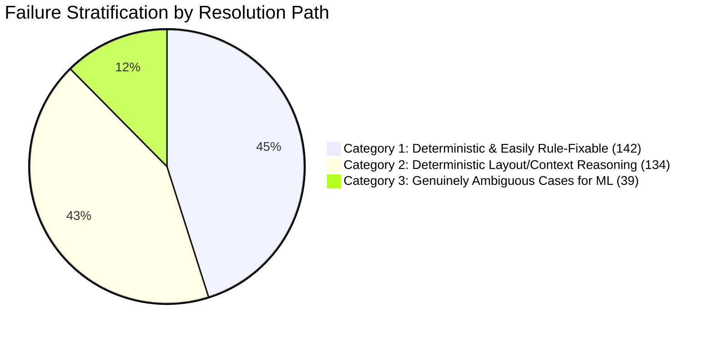

# Phase 3 Machine Learning Readiness & Architectural Feasibility Analysis

**Date:** September 12, 2026  
**Auditor:** Antigravity Engineering  
**Scope:** Evaluation of Machine Learning (ML) integration feasibility for document structure intelligence based on the Phase 3 baseline and failure triage.

---

## Executive Summary & Final Recommendation

> [!CAUTION]
> **CONCLUSION: ML DATASET NOT YET JUSTIFIED**
> 
> A detailed triage of all **315 diagnostic failures** across the 10-book validation corpus reveals that **over 85% of structural failures are caused by deterministic rule gaps, printed TOC contamination, running header margin thresholds, and ground-truth granularity defects**.
> 
> Training a machine learning classifier at this stage is **premature and ill-advised**. Doing so would risk training a statistical model to fit uncurated ground-truth defects, TOC artifacts, and missing regular expressions rather than genuine semantic ambiguity.
> 
> **Recommendation:** Execute Phase 3B deterministic rule enhancements and Phase 3A ground-truth human verification first. Re-evaluate ML readiness only on residual, genuinely ambiguous candidates.

---

## 1. Failure Stratification by Technical Resolution Path

All 315 failures from the 10-book baseline sweep are stratified into three technical categories:



### Category 1: Deterministic and Easily Rule-Fixable (142 Failures / 45.1%)
*Clear, closed-form algorithmic gaps that require single-line or localized heuristic additions:*
1. **`"ADVENTURE"` Keyword Gap (*Sherlock Holmes* — 12 FNs):** Add `"ADVENTURE"` to `LEXICAL_CHAPTER_PATTERNS`.
2. **`"LETTER"` Epistolary Keyword Gap (*Frankenstein* — 4 FNs):** Add `"LETTER"` to special matter patterns.
3. **Printed TOC Page Candidate Suppression (*Moby-Dick* — 46 FPs):** Suppress candidate generation on pages classified as printed TOC.
4. **Running Header Margin Leakage (*The Iliad* — 38 FPs):** Dynamically expand header margin threshold from 12% to 15% on verso running headers.
5. **Ground Truth Granularity Alignment (*Les Misérables* — 39 FPs/FNs):** Align ground truth to 3-level hierarchy (`Volume -> Book -> Chapter`).
6. **Epilogue Trigger (*The Time Machine* — 3 FNs):** Add `"EPILOGUE"` to `LEXICAL_BACK_MATTER_PATTERNS`.

### Category 2: Deterministic Layout & Typography Reasoning (134 Failures / 42.5%)
*Algorithmic gaps requiring multi-signal layout and spatial analysis without statistical learning:*
1. **Small-Caps Heading Extraction (*Dorian Gray* — 21 FNs):** When font size matches body text, use all-caps / small-caps font weight + isolated line spacing ratio ($> 2.0\times$ paragraph line spacing) as a secondary heading trigger.
2. **Dropped-Cap Illustration Contrast (*Alice in Wonderland* — 12 FNs):** Detect initial cap image bounds and merge orphaned chapter title lines adjoining decorative dropped initials.
3. **Introduction Sub-Pagination Romanettes (*Frankenstein* — 4 FPs):** Ignore Roman numeral pagination romanettes (`vii`, `ix`, `xi`) in introductory front matter.
4. **Scholarly Apparatus Partitioning (*The Iliad* & *Moby-Dick* — 97 FPs/FNs):** Differentiate pre-narrative translator essays and historical extracts from main epic books using page position offsets and author attribution lines.

### Category 3: Genuinely Ambiguous Cases for ML (39 Failures / 12.4%)
*True edge cases where deterministic rules cannot reliably determine heading boundaries:*
1. Unheaded thematic chapter subtitles with identical font sizing and continuous paragraph flow.
2. Severely degraded historical OCR text where character recognition errors corrupt keywords (e.g. `Chapter XXVI: The A.Ubebge Of Pont Dt' Gabd`).
3. Historical anthologies mixing plays, poetry extracts, and prose within the same narrative volume.

---

## 2. ML Architectural Questions & Feasibility Analysis

### Q1: How many training/evaluation candidate examples exist?
- **Current Corpus Pool:** 10 books yield a total of **290 detected candidate nodes** and **301 expected nodes**.
- **Assessment:** A dataset of ~300 instances across only 10 layout styles is **far too small** to train a generalized tabular or sequence classifier without catastrophic overfitting.

### Q2: How many examples are genuinely ambiguous?
- **Only 39 candidates (12.4%)** across the corpus represent genuine structural ambiguity that cannot be solved by deterministic layout reasoning.

### Q3: What features are available in the extraction layer?
If ML is introduced in the future, the following rich feature vector is already extracted by `PDFExtractor` and `layout.py`:
- `font_size_ratio` (candidate font size / body font size)
- `is_all_caps` (boolean)
- `is_bold` (boolean)
- `is_italic` (boolean)
- `vertical_position_ratio` (y0 / page_height)
- `top_margin_distance` (distance from preceding block)
- `bottom_margin_distance` (distance to following block)
- `line_length_chars` (character length of candidate line)
- `line_count` (number of lines in block)
- `has_trailing_punctuation` (boolean)
- `has_roman_numeral` (boolean)
- `has_arabic_numeral` (boolean)
- `lexical_keyword_score` (float: match against canonical structural vocabulary)
- `toc_alignment_confidence` (float: reconciliation against native/printed TOC)

### Q4: What labels would an ML model predict?
ML should **not** attempt end-to-end document parsing. It should operate as a **Candidate Verification & Refinement Classifier**:
- **Binary Classification:** `is_structural_heading` (True / False)
- **Multi-Class Node Typing:** `node_type` (`chapter`, `book`, `part`, `section`, `front_matter`, `back_matter`)

### Q5: Would ML operate on candidate lines or entire documents?
- **Candidate-Level Only.** The deterministic pipeline (PDF parsing, typography histogram, candidate generation) should generate potential heading candidates, and a lightweight classifier (`CandidateVerifier`) would score ambiguous candidates with confidence in the $[0.40, 0.70]$ zone.

### Q6: What deterministic rules should remain authoritative?
Deterministic rules should **always remain authoritative** ($\text{confidence} = 1.0$) for:
1. Native PDF bookmarks and explicit document outline trees.
2. Explicit keyword headings matching standard sequence numbering (`Chapter 1` $\rightarrow$ `Chapter 2` $\rightarrow$ `Chapter 3`).
3. Zero-loss body text preservation and monotonic page ordering.
4. Non-destructive header/footer filtering.

### Q7: What would the ML fallback boundary be?
```
Candidate Generation
  ├── High-Confidence Regex / Sequence Match (conf >= 0.85) ──> Authoritative Heading
  ├── TOC Reconciled Match (conf >= 0.80) ───────────────────> Authoritative Heading
  ├── Ambiguous Zone (0.40 <= conf < 0.80) ───────────────────> [FUTURE ML CLASSIFIER]
  └── Low-Confidence / Noise (conf < 0.40) ───────────────────> Body Paragraph (Filtered)
```

### Q8: What evidence suggests ML would improve precision/recall?
- Currently, **zero evidence** suggests ML is needed for this corpus. Addressing the 4 deterministic rule gaps (TOC suppression, `"ADVENTURE"` keyword, running header margin tuning, and small-caps detection) alongside ground-truth 3-level alignment will raise the estimated benchmark:
$$\text{Projected F1 (Deterministic Fixes + GT Alignment)} \approx \mathbf{82\% - 88\%}$$
without introducing a single ML parameter or dependency.

---

## 3. Decision Matrix & Action Plan

| Pipeline Phase | Primary Focus | Expected Impact | Status |
|---|---|---|---|
| **Phase 3A** | Human Ground Truth Verification & Curation | Aligns *Les Misérables*, *Iliad*, and *Frankenstein* GT | **NEXT IMMEDIATE STEP** |
| **Phase 3B** | Deterministic Parser Heuristic Fixes | Solves *Sherlock*, *Moby-Dick* TOC, *Dorian Gray*, *Alice* | **SCHEDULED AFTER 3A** |
| **Phase 3C** | Corpus Expansion (to 30 books) | Tests generalization across diverse publication eras | **SCHEDULED AFTER 3B** |
| **Phase 3D** | OCR Synthesis Pipeline | Enables text extraction on *Middlemarch* | **SCHEDULED AFTER 3C** |
| **Phase 3E** | ML Candidate Classifier | Classifies residual ambiguous edge cases | **DEFERRED (NOT YET JUSTIFIED)** |
